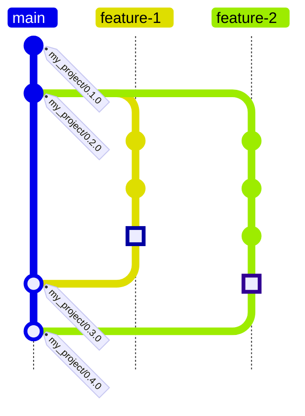
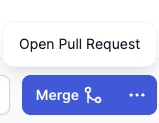
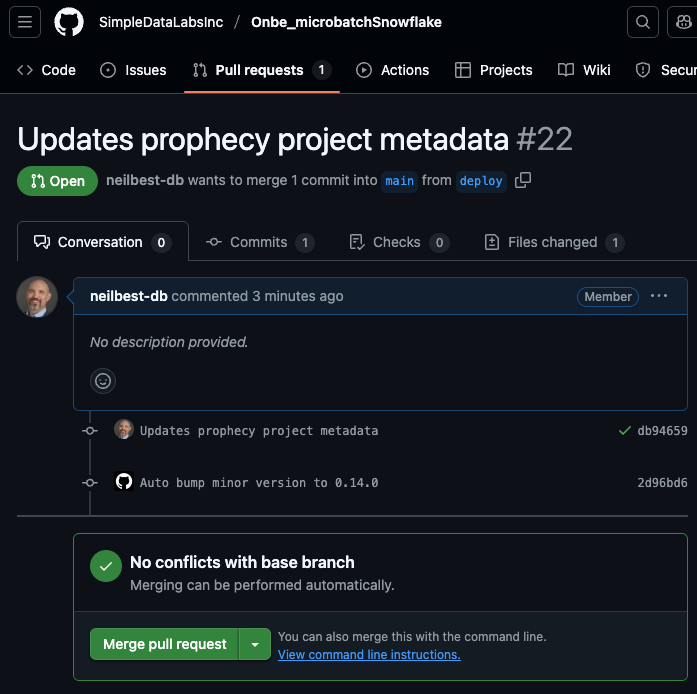
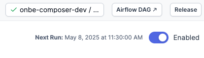
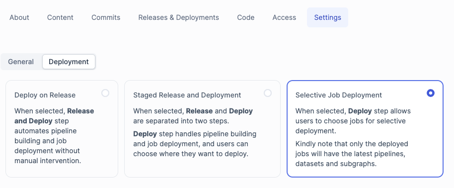
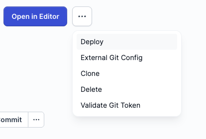
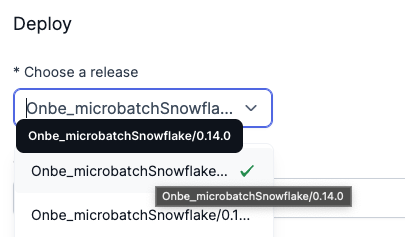
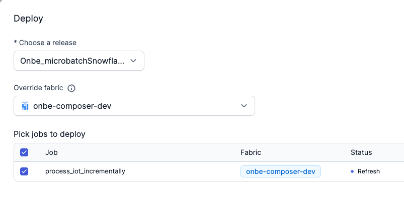

# CI/CD for Prophecy SQL Projects at Onbe


## Introduction

This repository provides the necessary components to add to a
[Prophecy](https://www.prophecy.io/) SQL Project's GitHub repository to satisfy
Onbe's requirements for continuous integration/continuous delivery (CI/CD)
automation. The necessity of this customization arises from Onbe's requirement
that default branches (usually named `main`) in Onbe's GitHub repositories are
protected by GitHub rulesets that prevent developers from pushing Git commits
from a feature branch (or "head" branch) directly to the default branch (or
"base" branch)[^1]. Instead, production-ready code that is to be deployed to the
production environment must be reviewed and approved through GitHub's Pull
Request (PR) mechanism to merge it into the default branch.

**This repository defines a set of GitHub Actions (GHA) workflows to perform the
following operations during the lifecycle of a Pull Request that has the default
branch as its target:**


Prior to the merge:

- Check that the Project minor version number[^2](see also "[Versioning and
  tagging](#versioning-and-tagging)" below) in the Prophecy metadata on
  the feature/"head" branch of the PR is greater than the default/"base" branch;
  if not; increment the minor version.
  
- Run the DBT tests defined in the Project using the [DBT Core
  CLI](https://docs.getdbt.com/reference/commands/test)(`dbt test`).


After the merge:

- Tag the merge commit with the new semantic version intorduced to the default
  branch from the feature branch.


These actions correspond to the following [workflow definition
files](https://docs.github.com/en/actions/writing-workflows/about-workflows) in
the special [`.github/workflows`](.github/workflows) folder at the root of this
repository:


Prior to the merge:

- `check-prophecy-minor-version.yml`
  
- `run-dbt-tests.yml`


After the merge:

- `tag-release.yml`


See the next section for details on the behavior of these workflows and other
special files present in the repository necessary for their successful
execution.

> [!TIP]
> Don't care about the gory details?  Then skip the following section on
> [Repository Contents](#repository-contents) and go straight to the good part, [Add these GitHub Actions to a Prophecy Project](#add-these-github-actions-to-a-prophecy-project)! 

> [!CAUTION]
> Are you sure you know what you are doing?  There is some important information
> among those gory details . . . you have been warned!


## Conventions

### Notation

Throughout this document, first-class entities in Prophecy SQL/DBT Projects such
as Models and Tests (and "Projects" themselves!) will be capitalized to
emphasize their particular meaning in this context.

File names and paths, YAML elements (keys and values), and executable
utilities/commands will be shown in `monospace`.


### Branching model

The current implementation of this CI/CD automation is not sensitive to the
developers' choice of branching model, whether it be GitHub Flow, Git Flow, or
any other branching convention.  This is because the workflows are configures to
execute only on activity in the `main` branch, which is assumed to be the
Project repository's default branch and also a protected branch, as determined
by the repository's rulesets.

To apply a branching model similar to Git Flow where feature branches are merged
into a common `dev` branch and only `dev` get merged into `main`, no changes to
the current CI/CD-GHA configuration are necessary.  Although there are currently
no hard constraints in place to enforce such a branching model, it will be up to
the team to define and socialize their conventions in order to apply them
consistently.  A PR approver would manually close a malformed PR that specifies
merging a feature branch directly into `main`, for example, adding a comment
explaining how to open a new, correct PR with `dev` as its base branch.


### Versioning and tagging

As with the branching model, the current CI/CD implementation is only
responsible for applying tags to the protected `main`/default branch because it
only to merges into `main`.  Because `main` is protected by GitHub
rulesets, merges into it can only occur through pull requests (PRs).  As
mentioned in the [introduction](#introduction) above, the tagging logic in the
GHA workflows only manipulates the `MINOR` component of the `MAJOR.MINOR.PATCH`
convention known as "semantic versioning".  Therefore it is natural to utilize
the `PATCH` component for "development releases" of commits on the common `dev`
branch.  For example, after production release `0.1.0`, a new `dev` branch would
be created at that point.  As new feature branches get merged
into `dev`, it is natural and recommended to tag these "developement releases"
like `0.1.1`, `0.1.2`, etc.  These tags with incrementing `PATCH` versions will
be specified manually in the Prophecy UI because no CI/CD is neccessary, nor
defined, for the unprotected `dev` branch.


### GitHub Flow

The CI/CD design in this repository is based on the well-known workflow model
known as "[GitHub
Flow](https://docs.github.com/en/get-started/using-github/github-flow)"(also see
[this article](https://githubflow.github.io/)).  This simple "branching model"
(or "branching strategy") assumes that code in the default branch (usually
`main`) is always production-ready and only accepts changes via pull requests
and merge commits.  All other branches are "feature branches" where new code is
developed and tested before being merged into `main`.  Before illustrating this
method of source code management, let's establish some terminology.


#### Terminology

- A **commit** is a set of changes to one or more files.
- A commit usually has a single parent commit.
- A **branch**** is a named pointer to a commit that advances to a new child commit (the
  "tip" or "head" of the branch).
- The **default branch** of a repository is the branch that is first displayed
  in the GitHub web UI and the only branch that is downloaded when cloning a
  remote repository.
- Creating a new branch causes two branches to diverge from a common parent commit
  after new child commits have been pushed to either of those branches. 
- A **merge commit** usually has two parents, the previous commits of the two
  participating branches, the "head branch" and the "base branch".
- A **pull request** (or "PR") previews the effect of a proposed merge request,
  which is to modify the files at the tip of the base branch with the changes
  accumulated in the head branch since the branches diverged.
- The typical head branch in this model is usually called a **"feature branch"**
  because it introduces a new feature to the code base.
- A **tag** is also a named pointer to a commit, very similar to a branch except that it
  doesn't advance with new commits pushed to the branch.

  
#### Example workflow

In GitHub Flow, the repository's default branch (usually `main`) is protected by
its settings in GitHub, thus requiring changes to be reviewed through the pull
request process.  This review process includes automated actions that are
triggered by specific events in the repository.  More about these actions in a
later section.  First let's see how GitHub Flow coordinates the efforts of a
team working on a common code base.

In this example we see a sequence of development activities on a repository
named `my_project` with time advancing from top to bottom. Initially the tip of
the `main` branch is tagged with the most recent release, `my_project/0.1.0`.
The name of any tag is arbitrary in general, but in this example tags follow the
Prophecy convention of `<repository name>/<semantic version>`. Two developers
then indepdentently create new feature branches, `feature-1` and `feature-2`,
from that commit and begin work on newly assigned tasks.  Because their feature
branches are not protected in GitHub they are able to push commits to the master
copy of the repository on GitHub's server (often called the "origin") through
the Prophecy UI.





After a couple of commits on each branch, the developer working on `feature-1`
decides that their new code is ready to be considered for deployment to the
production environment. Because `main` is protected, the only way for the
changes in `feature-1` to be applied to `main` is through a PR.  When a
developer tries to perform the merge in Prophecy they will get an error.


Instead of using the "Merge" button in the lower right corner of Prophecy UI,
they must click on the three dots to see the option to open a PR.



This will open a new browser tab in GitHub.com with a form pre-populated with
the head and base branches, `feature-1` and `main` respectively, for the
developer to fill out with an optional description before creating the PR.  Upon
PR creation, GitHub Actions runs the checks that are configured to run at
this moment.   More on those checks later, but here we see that the checks
completed successfully (indicated by a green check mark), and that an additional
commit was pushed to the head branch by the automated actions.


Clicking on the green check mark reveals a list of checks performed and links
to further details about them.



At this point, the team may conduct a code review, either virtually within the
PR itself by making comments or by discussing the proposed changes in a meeting.
Assuming everything looks fine, a privileged GitHub user then completes the PR
by clicking on "Merge pull request" and optionally deleting the feature branch
(which is just a pointer to the newest commit; totally safe).


Referring back to the workflow diagram, notice that the last commit on each
feature branch prior to being merged into `main` has a special square icon.
This represents the automated commit that was pushed to the feature branch by
the CI/CD automation shortly after the PR was created.  More about this later,
but as the commit message in the GitHub screenshots above indicates, the
Prophecy metadata in the feature branch has been updated with a new semantic
version by incrementing the minor version.

Ater a PR is completed and its feature branch has been merged into `main`, the
CI/CD automation tags the merge commit with the new semantic version. These PRs
may exist and proceed simultaneously, but GitHub ensures that the merge commits
occur separately. The merge commit of the first PR to be accepted and completed
(rather than rejected and closed) becomes the tip of the base branch of other
existing PRs, which causes all of their checks to be repeated. After at least
one PR has produced new commits and tags on the default branch the team has an
opportunity to to return to the Prophecy UI and deploy any tagged commit (or
"release") to an orchestration environment associated with the Prophecy Project
via an orchestration Fabric, as we will see in the next section.

> [!TIP]
> At this point, the reader may consider skipping ahead to learn more about
> the [contents of this repository](#repository-contents) and [how to use its
> GitHub Actions](#add-these-github-actions-to-a-prophecy-project) in another
> Prophecy Project before continuing with the release process here.  Choose your
> own adventure!


#### Deployment process

To begin the deployment proces . . .












## Repository Contents

The following file tree diagram[^3] enumerates the special files that ship with
this template. The purpose of each of these files will be described in the
reamainder of this document. Other folders and files that may be present in this
repository (usually on some bramch other than `main`) or a clone/fork of same
are either generated and maintained automatically by the Prophecy platform or
are in need of additional documentation here.

```plaintext
.
├── .github/workflows/
│   ├── check-prophecy-minor-version.yml
│   ├── run-dbt-tests.yml
│   └── tag-release.yml
├── .gitignore
├── .tool-versions
├── Onbe_CICD_template/
│   ├── models/
│   │   └── null_model.sql
│   ├── tests/
│   │   └── null_model.sql
│   └── [ other generated folders & files ] 
├── Pipfile
├── Pipfile.lock
├── README.md
├── profiles.yml
└── [ other generated files ]
```

### `.github/workflows/`

This folder contains the definitions of GitHub Actions that automate the CI/CD
operations. Review the [Introduction](#introduction) above for context regarding
the following details.

These workflows each perform the following common setup actions before
proceeding to their distinctive operations in an isolated execution environment
provided by GitHub Actions:

- Clone the Project repository locally
- Fetch and checkout the feature branch (or "head")
- Install Python and necessary Python packages:
  - [`pipenv`](https://pipenv.pypa.io/en/latest/)("a Python `virtualenv` management tool")
  - [`pbt`](https://docs.prophecy.io/engineers/prophecy-build-tool/)("Prophecy
    Build Tool"; used here to manage release version metadata and tags)
  - [DBT Core](https://docs.getdbt.com/docs/core/about-core-setup)("database
    build tool"; an open-source component of the Prophecy platform)
  - `dbt-snowflake` (the Snowflake adapter for DBT Core)
  - dependencies of the above packages

Each individual workflow performs specific operations as follows:


#### `check-prophecy-minor-version.yml`

This workflow runs whenever a PR that has the default branch as its base is
opened or updated with a new commit. After setup, PBT looks for the most recent
Git tag that it recognizes as a Prophecy release tag on the base branch. If the
Project version in the Prophecy metadata files is not greater than that of the
release tag that it found then it bumps the version to make it one minor version
greater than the tag it found. Then it commits and pushes the changed metadata
files back to the incoming feature branch. That new commit becomes the "head" of
the feature branch. Technically this results in a failed workflow but GHA
detects a change to the PR itself and reinitiates the workflow. The new check
will succeed because of the new metadata in the feature branch. Any other
failure mode will block the PR from merging and will require manual intervention
because it is not anticipated by the existing workflow logic.

See its contents here:
[`.github/workfows/check-prophecy-minor-version.yml`](.github/workflows/check-prophecy-minor-version.yml)


#### `run-dbt-tests.yml`

Like `check-prophecy-minor-version.yml`, this workflow also runs whenever a PR
that has the default branch as its base is opened or updated with a new commit.
These two workflows are allowed to run concurrently because they have no
interaction or interdependency. This workflows performs the same setup, checks
the connection to the Snowflake target specified by the local `profiles.yml`
file (see [below](#profiles-yml)) and runs the tests defined in the Project
using DBT. If any test fails then the workflow will fail and the PR will not
allow the merge to proceed. The devloper must now determine what logic in the
Model(s), or in the test(s) themselves, to adjust before repeating the tests by
pusing a new commit to the feature branch.

See its contents here:
[`.github/workflows/run-dbt-tests.yml`](.github/workflows/run-dbt-tests.yml)


#### `tag-release.yml`

This workflow runs upon completion of a PR's merge into the default branch. It
assumes that whatever Project version that is present in the Prophecy metadata
is already set appropriately. It attempts to create a new release tag based on
the version information present in the Prophecy metadata in the default branch.
A failure of this workflow likely indicates that the particular release tag for
the current Project version already exists in the repository. This type of
failure should not normally occur, so some inspection and manual intervention
would be necessary in this scenario.

See its contents here:
[`.github/workfows/tag-release.yml`](.github/workflows/tag-release.yml)


### `.git/`

> [!NOTE]
> Returning to the top-level folder of the repository . . .

This folder acts as a kind of database for Git. It does not exist in GitHub,
only in cloned working copies. It is only mentioned here in order to deliver the
folllowing . . .

> [!WARNING]
> Do not attempt to manipulate this directory or its contents directly.  Any
> manual operation involving this folder without using the `git` utility is
> likely to have catastrophic consequences.


### `.gitignore`

This file tells Git what files it should ignore when reporting the current
status of a working copy of a Git repository. This is simply a convenience for
developers working directly with the repository.

> [!CAUTION]
> Another file with the same name may already exist in your project repository.
> In that case it is best to take the time to compare their contents and merge
> them manually, if appropriate, rather than overwriting the one in the target
> location with the one you see here.

See [here](https://docs.github.com/en/get-started/git-basics/ignoring-files) for
more information and resources related to the `.gitignore` file.


### `.tool-versions`

> [!NOTE]
> This file is only used by GHA, not Prophecy, `pbt`, `dbt`, or anything else.
> Most users will not interact with it directly.

It contains the Python version required during the workflows' setup steps,
currently pinned at `3.10.16`. It also contains a version specification for
`actionlint`, a tool used to validate GHA YAML files during development, but not
directly relevant to the GHA workflows.

> [!NOTE]
> This style of tool version specification comes from the well-known
> [`asdf`](https://asdf-vm.com/) version management project and was adopted by
> the `setup-python` action template as of its [v5.5.0
> release](https://github.com/actions/setup-python/releases/tag/v5.5.0) (see its
> PR [#1043](https://github.com/actions/setup-python/pull/1043) for details).


### `Onbe_CICD_template/`

> [!WARNING]
> As of the most recent update to this section, the GHA workflows defined in
> this project do not look for Prophecy projects in subfolders. This repository
> should not be cloned or used as a template except to house a single Prophecy
> project in the repository's root folder (`./`) until this warning has been
> removed, indicating that additional logic has been added to the workflows to
> accommodate the possible presence of multiple Projects in subfolders. This use
> of subfolders is the default when creating a new Project as of Prophecy
> release 4.0.0.0. The repository has adopted this layout simply to minimize the
> number of files and folders in its root folder.

This folder contains a minimal Prophecy SQL project here comprised of a single
trivial Model and single trivial Test. It will be utilized by a future version
of this template to manage Prophecy version metadata and release tags, and run
DBT tests, just as they would be currently for a Project defined in the
repository's root folder.


### `Pipfile` & `Pipfile.lock`

From the [Pipenv documentation](https://pipenv.pypa.io/en/latest/pipfile.html#pipfile-pipfile-lock):

> `Pipfile` contains the specification for the project top-level requirements
> and any desired specifiers. This file is managed by the developers invoking
> `pipenv` commands.
> 
> . . .
>
> `Pipfile.lock` replaces the `requirements.txt` file used in most Python
> projects and adds security benefits of tracking the packages hashes that were
> last locked. This file is managed automatically through locking actions.
>
> You should add both `Pipfile` and `Pipfile.lock` to the project’s source
> control.

These files are consulted by the GHA workflows during their setup steps. They
tell the `pipenv` tool exactly what software components to install in the
virtual environments where the core steps of the workflows run.


### `README.md`

This document.

> [!TIP]
> If you wish to have these notes in your Project repository then you will
> probably want to rename it. Alternatively, you may consider linking to an
> online version of this file in your Project repository's `README` file or
> other documentation instead. Take care not to overwrite an existing `README`
> in the target location.


### `profiles.yml`

This file contains data platform connection settings used by the DBT Core CLI
(`dbt`) to access remote SQL services (e.g. Snowflake, Databricks, PostgreSQL,
etc.) The particular instance of this file at the top level of this repository
is only used during the execution of the `run-dbt-tests.yml` workflow described
[above](#run-dbt-tests-yml).

Be sure to adjust any other parameters present in `profiles.yml`, such as
`account`, `role`, `database`, and `schema` as necessary for the Project's tests
to run correctly.  `database` and `schema` are especially important as those
will be the defaults for any bare, unqualified table names in the Project's
Models and Tests (e.g. `MY_TABLE` vs. `MY_DATABASE.MY_SCHEMA.MY_TABLE`).


## Add these GitHub Actions to a Prophecy Project

Now that you understand the purpose of each of the special files in this
repository (right? :wink:) and how to avoid corruption of the Prophecy Project repository you
would like to enhance with the CI/CD functionality contained here (right?
:wink::wink:), it's time to have some fun!

Otherwise, go back to the top and spend some time with all of the wonderful,
enlightening content that you just skipped.  You will be glad you did!


> [!NOTE]
> The remainder of this document assumes that the reader has basic fmailiarity
> and proficiency with the GitHub service, and, optionally, the `git` utility.
> An introduction to these topics is beyond the scope of this document. There
> are many online and print resources readily available to get you started.


### Setup

Preparing your amazing Prophecy Project's GitHub repository involves the
following steps, some of which occur in your local working environment (i.e.
your laptop/workstation's native filesystem) while others require logging in to
GitHub.com in a browser to perform certain administrative actions there.  If you
find that the descriptions of such actions presented here do not match what you
see in the GitHub web UI then you will need assistance from a colleague who has
administrative privileges in your organization's GitHub account.


#### Files

Copy the special files included in this repository and described in this
document into your SQL Project. This can be done in a local working copy after
using the GitHub Desktop app or the `git` command-line utility to clone the
Project repository, followed by copy-paste actions in your operating system's
desktop or by copying files using other command-line utilities.

Here is the essential subset of files listed and described above that another
Project repository **must** have for the GHA workflows to work correctly, but
this time presented as a flat list with paths relative to the repository's root
folder (`./`):

- `./.github/workflows/run-dbt-tests.yml`
- `./.github/workflows/tag-release.yml`
- `./.github/workflows/check-prophecy-minor-version.yml`
- `./.tool-versions`
- `./Pipfile`
- `./Pipfile.lock`
- `./profiles.yml`


#### Permissions

GitHub will not execute these workflows unless adequate [Actions permissions](https://github.com/SimpleDataLabsInc/Onbe_CICD_template/settings/actions)[^4]
are granted in the repository's settings under **Actions/General** as shown
here:


Choose the level of permissions to grant to GHA that is appropriate to your
repository, according to your organization's policies.


#### Secrets

As [described above](#run-dbt-tests-yml), the GHA workflow defined in
`run-dbt-tests.yml` runs any tests defined in the Project. To do this it must be
able to connect the remote data platform from the GHA execution environment.
Because this occurs outside of Prophecy and Airflow using the `dbt` CLI directly
there must be a `profiles.yml` file in the Project's source code repository (see
[above](#profiles-yml)).

To avoid storing the user names and passwords in plain text the repository-local
`profiles.yml` file used by GHA has Jinja template placeholders for those
parameters that get filled in by `dbt` at runtime.
To meet this need,
GitHub provides a secure mechanism to .

Like any GHA workflow, `run-dbt-tests.yml` has secure access to the [GitHub
secrets](https://docs.github.com/en/actions/security-for-github-actions/security-guides/using-secrets-in-github-actions)
defined in the repository's
[settings](https://github.com/SimpleDataLabsInc/Onbe_CICD_template/settings/secrets/actions)
in the GitHub web UI[^4]. The definition in `run-dbt-tests.yml` securely
populates environment variables with the necessary secret values to make them
available to the `dbt` executable at runtime in a standard way. These secrets
and their associated environment variables are named `DBT_USER` and
`DBT_PASSWORD` according to DBT
[conventions](https://docs.getdbt.com/reference/global-configs/about-global-configs#available-flags).

Under **Actions/Secrets and variables** in your Project's GitHub repository's
settings look for a green button labeled "New repository secret" to populate the
necessary values as shown here:


### Procedure

Condensing and presenting the information above as runbook-style steps:

1. Copy the [GHA workflow files](#github-workflows) from the
   `./.github/workflows/` folder of this repository to a Prophecy SQL/DBT
   Project GitHub repository.
   
1. Copy the these other files to their corresponding positions in your Project
   repository (see file tree diagram [here](#repository-contents)):
   
   - [`.gitignore`](#gitignore)
   - [`.tool-versions`](#tool-versions)
   - [`Pipfile`](#pipfile-pipfile-lock)
   - [`Pipfile.lock`](#pipfile-pipfile-lock)
   - [`README.md`](#readme-md)(optional; consider renaming it)
   - [`profiles.yml`](#profiles-yml)
   
1. Grant [permissions](#permissions) for GHA workflows to run in your Project's
   repository's settings.
   
1. Create and populate [secrets](#secrets) named `DBT_USER` and `DBT_PASSWORD`
   with appropriate values that will allow `dbt` to connect to your data
   platform (i.e. Snowflake) and run any Tests defined in your Project by
   filling in the corresponding values in the `profiles.yml` file in this
   repository.

1. Create a feature branch from the latest commit (the "tip" or `HEAD` commit)
   of `main` (or `dev`, according to the Project's [branching
   model](#branching-model)), and make some changes to the Project source code
   and/or metadata in the Prophecy UI.
   
1. Create a PR that indicates that the feature branch is ready to be merged into
   `main` and coordinate the appropriate review actions with the Project's
   designated reviewer(s).
   
1. As soon as the PR is opened two of the GHA workflows
   (`check-prophecy-minor-version.yml` and `run-dbt-tests.yml`) will run
   immediately as "checks" whose results will be visible in the PR upon
   completion.
   
1. Whenever the feature branch has a semantic version less than or equal to the
   version in the Prophecy metadata in `main`, GHA will use PBT to autmatically
   increment the `MINOR` version in the Prophecy metadata and push a new commit
   with that change to the feature branch.
   
1. Make additional commits to address any failures. Normally this should only
   involve the tests; the GHA automatically incrementing the `MINOR` version
   with a new commit is not considered a failure. GHA will repeat the checks
   after each commit to the PR's head branch, i.e. the feature branch.
   
1. As soon as both checks pass the PR is ready to proceed with approval from a
   designated reviewer.  Otherwise the reviewer would make comments on the PR or
   otherwise communicate the feature's branches deficiencies to the developer,
   thereby prompting additional commits on the feature branch.  The PR remains
   open during this iterative process.
   
1. Open completion of the PR, GHA detect the PR's merge commit on the `main`
   branch and the `tag-release.yml` workflow applies the appropriate tag with
   the newly incremented `MINOR` version.
   

### Troubleshooting

TODO


## Notes

[^1]: "Head" and "base" are terms inherited by GitHub from `git` itself and
    used occasionally in the GitHub UI.  They are mentioned here in an attempt
    to avoid a common source of confusion.

[^2]: As defined by "[semantic versioning](https://semver.org/)", mnemonicially
    respresented as `MAJOR.MINOR.PATCH`.

[^3]: File tree diagram generated using
    [tree.nathanfriend.com](https://tree.nathanfriend.com/) like
    [this](https://tree.nathanfriend.com/?s=(%27options!(%27fancy7~fullPath!false~trailingSlash7~rootDot7)~9(%279%27.github%2FworkflowsKcheck-prophecy-minor-45*run-dbt-tests5*tag-release52.gitignore2.tool-4s2Onbe_CICD_templateKF3test30oldH8%26%206J%20GG.lock2README.md2pro6s520ileJ%27)~4!%271%27)*2B0%5B%20othH%20genHated%20f2%5Cn3s*Bnull_F.sql*4vHsion5.yml6file7!true8s%209source!B%20%20FmodelG2Pip6HerJ8%5DK%2F*%01KJHGFB987654320*).

[^4]: Links to repository settings in the GitHub web UI given in this document
    are relative to the
    [SimpleDataLabsInc/Onbe_CICD_template](https://github.com/SimpleDataLabsInc/Onbe_CICD_template)
    repository where this document was originally composed. The corresponding
    settings for other GitHub repositories will require substition of the
    `<owner>` and `<repo>` slots in
    `https://github.com/<owner>/<repo>/settings/actions` (for example) in the
    URL after your browser has attempted to access the original repository.
